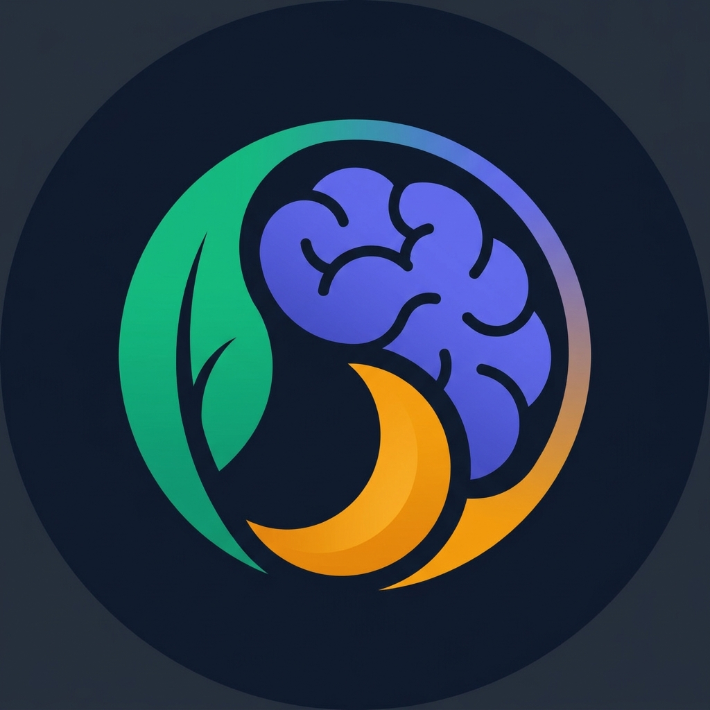
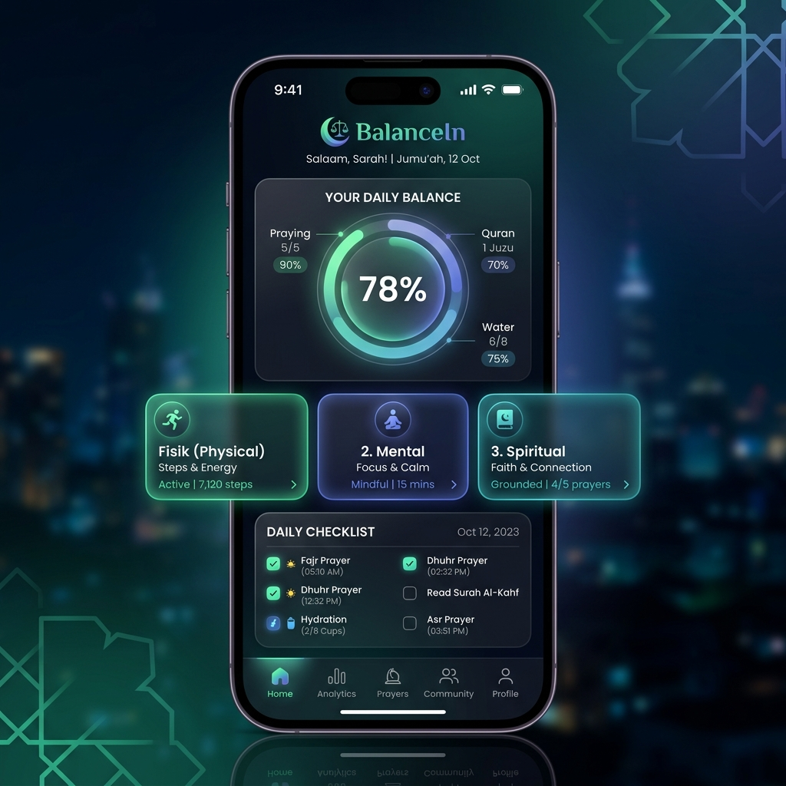

<div align="center">
  
  <h1>BalanceIn ⚖️</h1>
  <p><strong>Life Balance Reminder: Fisik, Mental, dan Spiritual.</strong></p>
  <p><i>Dibuat untuk Juara VibeCoding Google 🚀</i></p>

  
  
  
</div>

---

<div align="center">
  
</div>

## 🌟 Tentang BalanceIn

**BalanceIn** adalah aplikasi PWA (Progressive Web App) yang dirancang untuk membantu Anda menjaga keseimbangan hidup melalui tiga pilar utama:
1. 💪 **Kesehatan Fisik** (Target Minum, Waktu Olahraga)
2. 🧠 **Kesehatan Mental** (Kualitas Tidur, Mood Check-in, Latihan Pernapasan, Jurnal Syukur)
3. 🕌 **Kesehatan Spiritual** (Pelacak Sholat 5 Waktu, Dzikir Harian, Tilawah Quran, Tracker Puasa)

Aplikasi ini menggunakan pendekatan *Offline-First* sehingga Anda tidak perlu login. Seluruh data disimpan dengan aman secara lokal di perangkat Anda. Anda dapat mencadangkan (*backup*) data kapan saja melalui fitur Export/Import.

Lebih dari sekadar pelacak, BalanceIn dilengkapi dengan **AI Coach pintar (ditenagai oleh Google Gemini)** yang akan menganalisis progres Anda, memberikan motivasi yang dipersonalisasi, dan membuat laporan mingguan!

## ✨ Fitur Utama

- 📱 **Progressive Web App (PWA)**: Install langsung ke *home screen* tanpa lewat App Store/Play Store.
- 🎨 **Premium UI/UX**: Antarmuka modern dengan gaya *Glassmorphism*, transisi mulus, dan *Dark Mode* cantik.
- 🤖 **Gemini AI Coach**: Asisten AI yang memahami data progres Anda untuk memberikan *insight* dan semangat secara real-time.
- 🧭 **Kompas Kiblat Pintar**: Menunjukkan arah kiblat secara presisi berdasarkan *Geolocation* perangkat (di tab Ibadah).
- 🏆 **Sistem Pencapaian (Achievements)**: Dapatkan lencana (badge) setiap kali Anda mencapai rekor tertentu (e.g., Sholat lengkap, Dzikir tuntas, Streak 7 Hari).
- 🧘 **Ruang Ketenangan**: Dilengkapi panduan latihan pernapasan (Metode 4-7-8) dan *Gratitude Journal* untuk mengurangi stres harian.
- 💾 **Privasi Total (Local Storage)**: Tanpa login, tanpa *database* awan. Ekspor dan impor data sesuka Anda dengan format JSON.

## 🛠️ Tech Stack

- **Frontend**: HTML5, Vanilla JavaScript, Native CSS (Tidak bergantung pada framework berat).
- **Backend**: Node.js + Express.js (Untuk menyembunyikan API Key dengan aman).
- **AI Engine**: Google Gemini Flash (via `@google/genai`).
- **External API**: AlAdhan API (Jadwal Sholat Akurat).
- **Deployment**: Google Cloud Run & Google Artifact Registry.
- **Containerization**: Docker (Multi-stage build).

## 🚀 Panduan Menjalankan Secara Lokal

1. **Clone repository ini:**
   ```bash
   git clone https://github.com/wildaafn/balancein.git
   cd balancein
   ```

2. **Install dependency:**
   ```bash
   npm install
   ```

3. **Atur Environment Variables:**
   Buat file `.env` di *root directory* dan tambahkan API Key Gemini Anda:
   ```env
   GEMINI_API_KEY=api_key_anda_di_sini
   PORT=8080
   ```

4. **Jalankan *Development Server*:**
   ```bash
   npm run dev
   ```

5. Buka `http://localhost:8080` di browser Anda.

## ☁️ Deployment ke Google Cloud Run

Aplikasi ini siap digunakan (Production-ready) dan dilengkapi dengan `Dockerfile` yang telah dioptimasi.

```bash
# 1. Pastikan Anda telah mengonfigurasi gcloud dengan project Anda
gcloud config set project [PROJECT_ID_ANDA]

# 2. Build dan Deploy langsung dari source code
gcloud run deploy balancein \
  --source . \
  --platform managed \
  --region asia-southeast2 \
  --allow-unauthenticated \
  --set-env-vars="GEMINI_API_KEY=API_KEY_GEMINI_ANDA"
```

## 🤝 Kredit
**vibecode by WildaAfn**  
*Dikembangkan secara khusus untuk Event Juara VibeCoding Google.*
